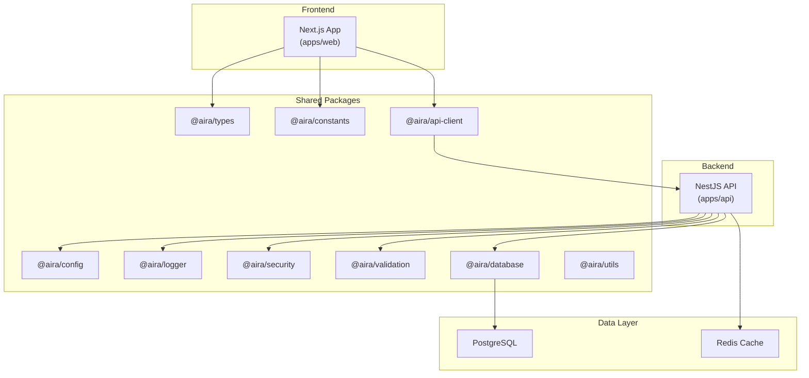

# Architecture Mapping

This document maps the frozen AIRA v1.5 architecture to the implementation structure.

## Platform Architecture Overview

## Module Boundaries

| Module           | Responsibility                                     | Package              |
| ---------------- | -------------------------------------------------- | -------------------- |
| Types            | Shared TypeScript interfaces and types              | `@aira/types`        |
| Constants        | Application-wide constants and enums                | `@aira/constants`    |
| Validation       | Input validation schemas (Zod)                      | `@aira/validation`   |
| Configuration    | Environment loading, feature flags                  | `@aira/config`       |
| Logging          | Structured logging (pino)                           | `@aira/logger`       |
| Utilities        | Common helper functions                             | `@aira/utils`        |
| Security         | JWT, hashing, sanitisation                          | `@aira/security`     |
| API Client       | Typed HTTP client for frontend                      | `@aira/api-client`   |
| Database         | Prisma ORM, repositories, migrations                | `@aira/database`     |
| Testing          | Factories, mocks, matchers                          | `@aira/testing`      |
| API Application  | REST endpoints, middleware, guards                  | `@aira/api`          |
| Web Application  | UI, routing, components, themes                     | `@aira/web`          |

## Future Phase Mapping

| Architecture Phase | Implementation Phase | Status     |
| ------------------ | -------------------- | ---------- |
| Phase 1–3          | Phase 1 Foundation   | ✅ Current |
| Phase 4–6          | Phase 2 Core AI      | ⏳ Next    |
| Phase 7–9          | Phase 3 Advanced     | 📋 Planned |
| Phase 10–12        | Phase 4 Enterprise   | 📋 Planned |
| Phase 13–15        | Phase 5 Federation   | 📋 Planned |
